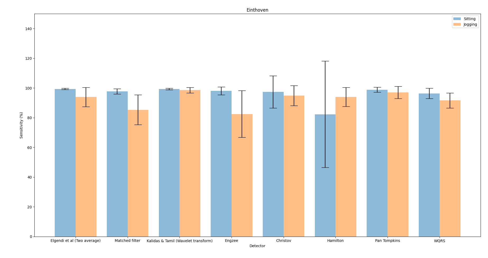

# JA Benchmark Analysis for heartbeat detectors

A benchmarking analysis method that generates an overall benchmark for
ECG detector algorithms, based on measurements of temporal jitter (J)
and (A) accuracy

The Glasgow University GUDB ECG recordings database ([Howell and Porr,
2018](http://dx.doi.org/10.5525/gla.researchdata.716)) is used for
testing as it has annotated R-peaks for reference. The detector
algorithms are tested using recordings for all subjects, all
exercises, and Einthoven II and chest strap leads (Einthoven I and
Einthoven III can additionally be used if desired).

The benchmark gives a score between 0-100 where 100 is defined as the
ideal detector. The ideal detector has
a median absolute deviation (MAD) of zero for temporal jitter
and an accuracy of 100%.

## Prerequisites

Install `py-ecg-detectors` ([Howell and Porr, 2019](https://doi.org/10.5281/zenodo.3353396)).

via PIP:
```
pip install py-ecg-detectors [--user]
```

From source:
```
python3 setup.py install [--user]
```
*Use the option --user if you don't have system-wise write permission.*

---
Install ecg_gudb_database ([Howell and Porr, 2018](https://pypi.org/project/ecg-gudb-database/)) via the package manager [pip](https://pip.pypa.io/en/stable/) or pip3 which is a version of the pip installer for Python3.

```bash
pip install ecg_gudb_database
pip3 install ecg_gudb_database
```

## Usage

### ja_analysis.py

JA analysis of interval variation and accuracy (FP, FN, TP & TN):

```
evaluate(det_posn, anno_R, fs, nSamples, trim=True)
```

Arguments:

    - det_posn: the timestamps of the detector in sample positions
    - anno_R: the ground truth in samples
    - fs: sampling rate of the ECG file
    - nSamples: number of samples in the ECG file
    - trim: trims 2 detections from start/end of det_posn/anno_R


Returns:

    - ja[key_jitter]   : jitter in s
    - ja[key_tp]       : true positive beats
    - ja[key_tn]       : true negative beats
    - ja[key_fp]       : false positive beats
    - ja[key_fn]       : false negative beats
    - ja[key_accuracy] : accuracy
    - ja[key_ja]      : JA Score


### ja_evaluate_all_detectors.py

The code evaluates all ECG detectors with all subjects, all leads, and all
experiments. It outputs separate json files for every detector and stores
them in the `results` directory.

### ja_stats_plots.py

The overall JA Benchmark values for Einthoven
II and chest strap results are shown together on a bar graph for
comparison for sitting and jogging.


# Traditional sensitivity analysis

For a sensitivity analysis on an `fs/10` samples temporal window run:

```
python sensitivity_evaluate_all_detectors.py
python sensitivity_stats_plots.py
```



Note that a pure sensitivity analysis on a wide temporal window
yields mostly 99-100% sensitivity.

# Credit

 - Bernd Porr <bernd.porr@glasgow.ac.uk>
 - Eleanor Forsyth
